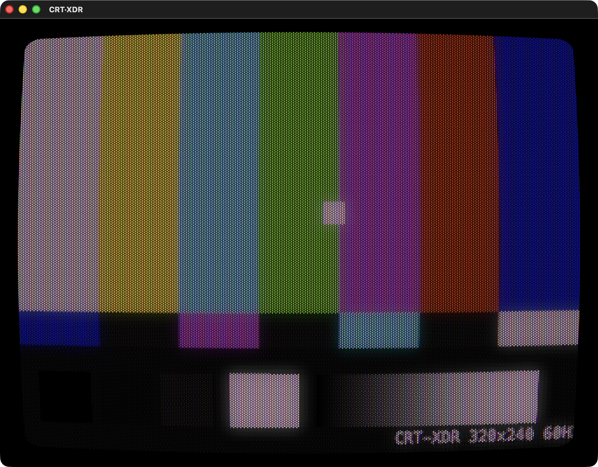
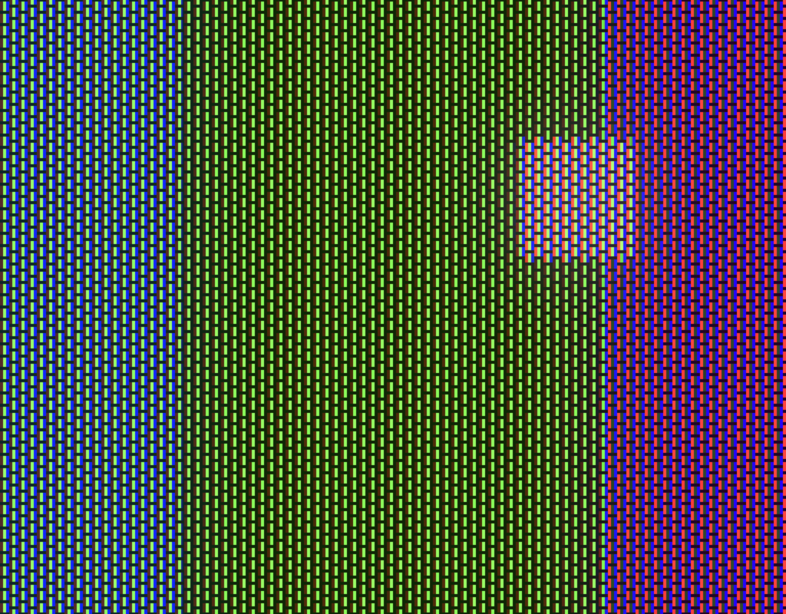
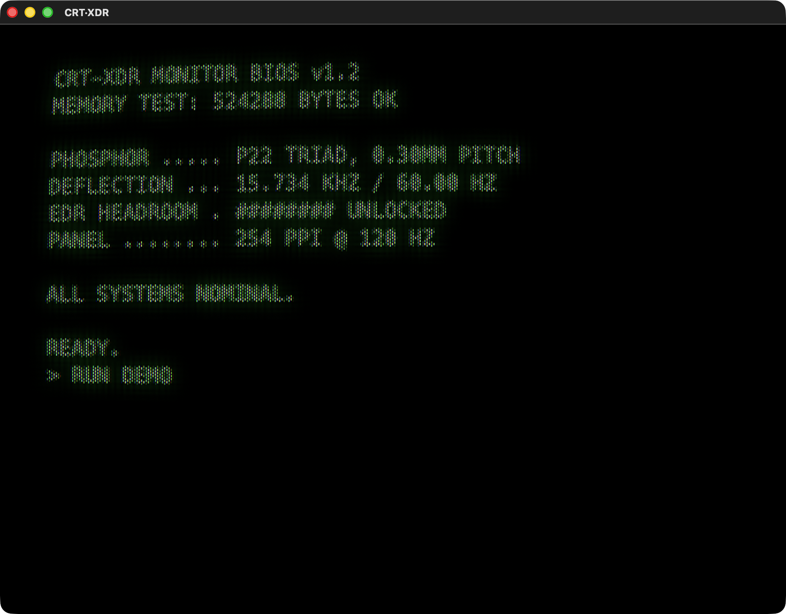
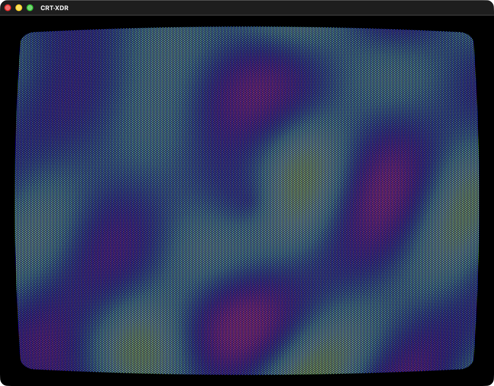
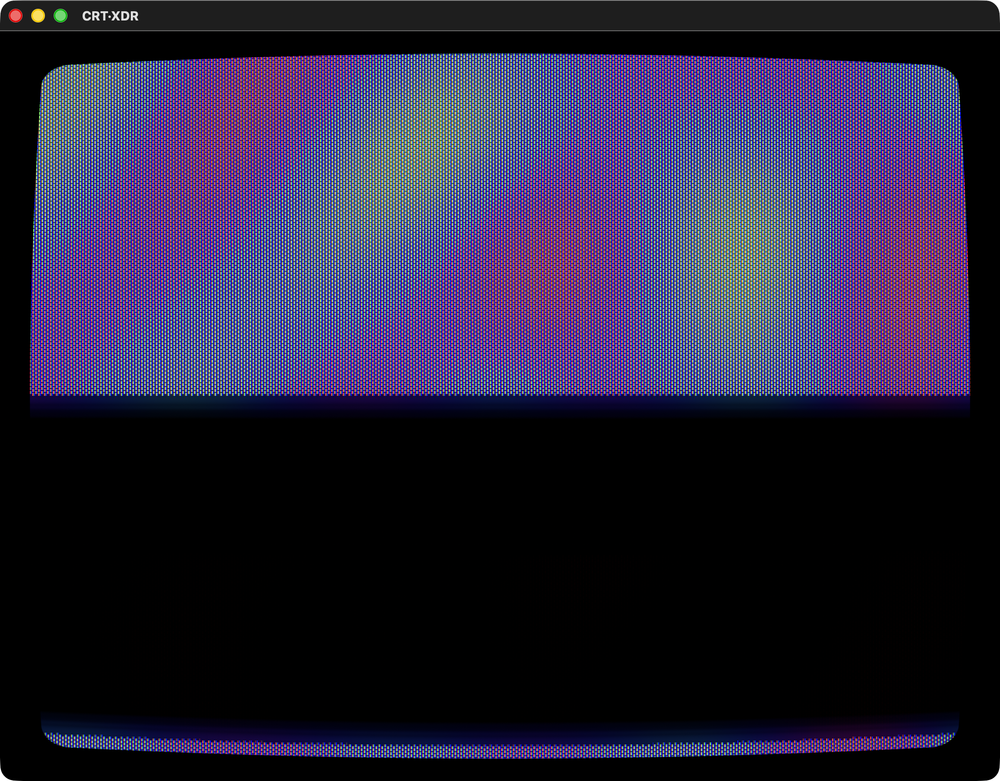
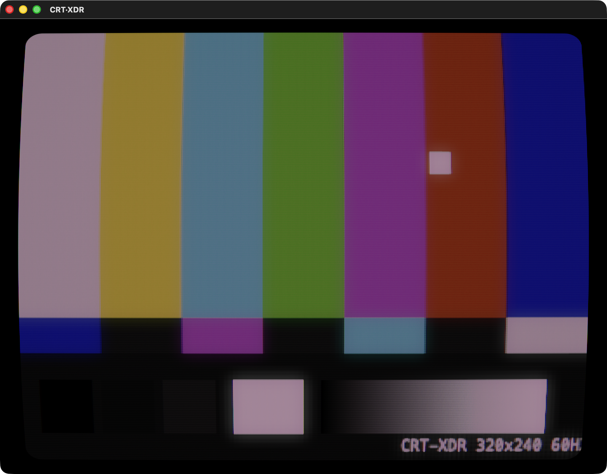
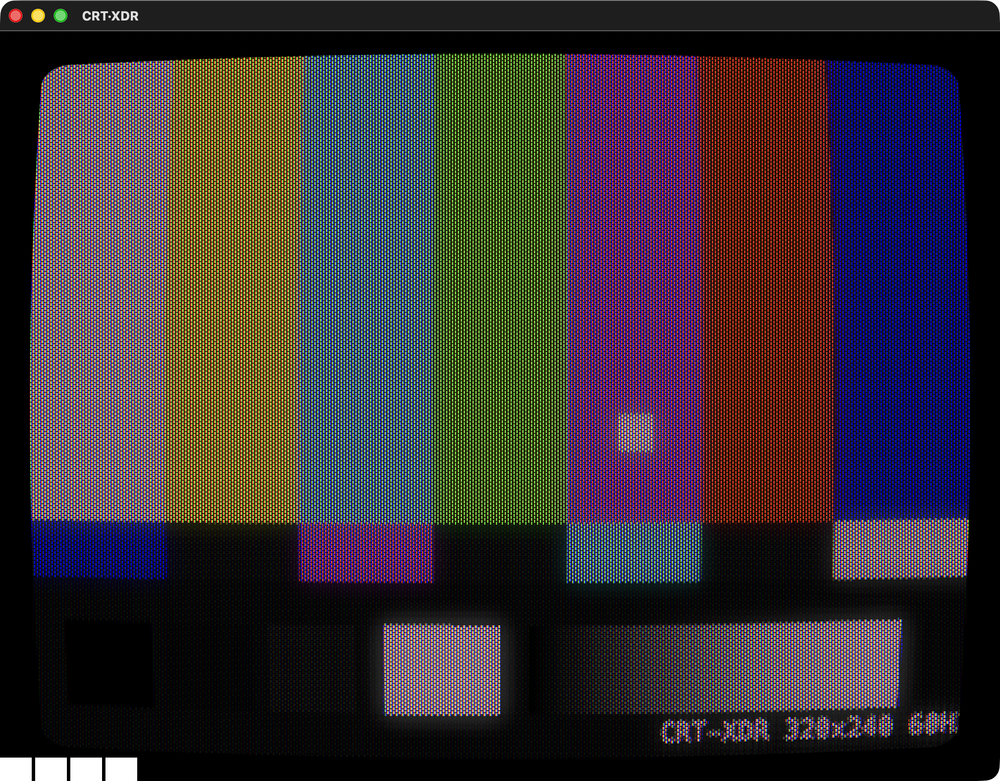
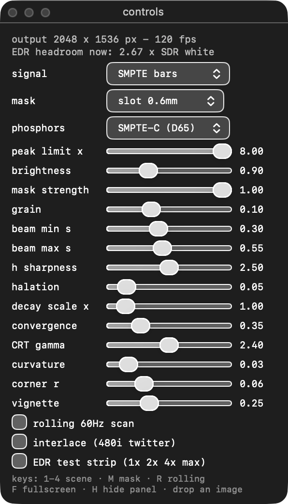

# CRT·XDR

A CRT simulation for Mac Retina HDR displays. Native macOS, Metal, single file.



*SMPTE bars through the default 0.6mm slot mask: discrete phosphor pills in a
staggered brick layout, spherical tube curvature, corner vignette.*

Modern CRT filters must darken the image to draw scanlines and phosphor masks.
This one doesn't: it renders into an `rgba16Float` extended-linear-sRGB
`CAMetalLayer` with EDR enabled, so a flat white area still *averages* to
standard SDR white while the scanline beam crests and lit phosphors ride
2–3× brighter into the display's EDR headroom — the same way a real tube's
electron gun overcomes its shadow mask. At ~254 ppi the simulated 0.3–0.6mm
phosphor triads are drawn per physical pixel at true dot-pitch scale, and
120Hz ProMotion allows a real rolling 60Hz beam with phosphor decay.

## Modeled physics

- Gaussian beam spot with brightness-dependent blooming, energy-normalized
- Aperture grille and slot masks at 0.3/0.6mm pitch; slot phosphors are
  discrete rounded pills (staggered brick) that integrate the beam per cell,
  with soft deposition edges and static powder grain
- SMPTE-C phosphor chromaticities (with optional 9300K consumer white),
  tube EOTF gamma 2.4 vs the 2.2 signal
- Per-phosphor P22 decay (red Y₂O₂S:Eu ~1ms lags the green/blue sulfides)
- R/B misconvergence growing from zero at center toward the edges
- Halation from faceplate glass scattering, corner vignette
- Spherical tube curvature; cylindrical (flat-vertical) for grille modes
- Optional rolling 60Hz scan and 480i interlace line twitter
- Built-in EDR test strip (1×/2×/4×/max SDR white) to verify HDR is live

## Screenshots



*Close-up of the slot-mask phosphor pills at physical-pixel scale, with
per-cell powder grain and halation glow around the bright square.*

| | |
|---|---|
|  |  |
| Green-phosphor terminal with typed boot sequence and blinking cursor | Plasma demo through the slot mask |
|  |  |
| Rolling 60Hz scan frozen mid-sweep: the beam band is bright, the rest decays per-phosphor | Aperture grille 0.3mm — cylindrical (flat-vertical) Trinitron geometry |
|  |  |
| EDR test strip: 1×/2×/4×/max SDR-white patches (bottom left) confirm HDR is live | Floating controls panel with live fps and EDR headroom readout |

## Build & run

```sh
swiftc -O main.swift -o crt-xdr
./crt-xdr
```

Requires a Mac with an EDR-capable display (any recent MacBook Pro XDR
panel; falls back to SDR elsewhere). Signals: SMPTE bars, green-phosphor
terminal, plasma demo, or drag any image onto the window.

Keys: `1–4` scene · `M` mask · `R` rolling scan · `I` interlace ·
`T` EDR test strip · `F` fullscreen · `H` hide controls
